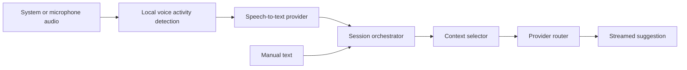
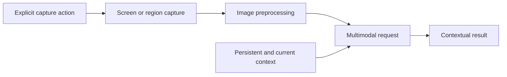
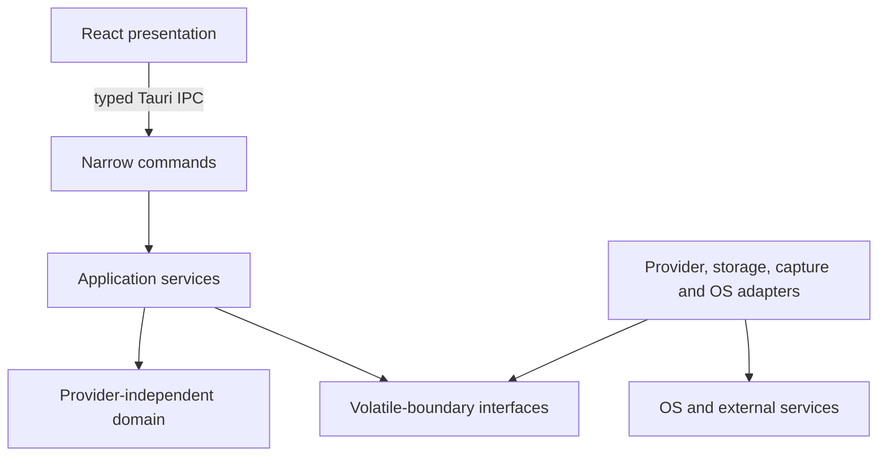
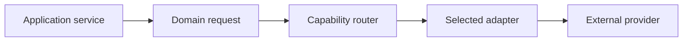

# Singularity Live engineering guide

This document is the canonical product architecture, engineering policy, roadmap, and
implementation-status record. It describes both current code and deliberately planned
boundaries. A capability is not implemented unless the current-status sections say so.

## 1. Product overview

Singularity Live is a real-time desktop context copilot. Its intended product loop is
“hear + see + remember + reason”: combine live speech, manual input, screenshots,
persistent user context, and recent session context to produce low-latency assistance.

The application is appropriate for consent-based interviews and assessments, pair
programming, technical calls, study, code explanation, debugging, and contextual desktop
assistance. It will not hide from screen sharing, evade capture, interfere with monitoring,
or covertly manipulate another application's capture pipeline.

### Terminology

- **Session**: one continuous assisted interaction.
- **Context pack**: versioned persistent user context stored as a YAML manifest plus
  human-readable Markdown files.
- **Transcript entry**: a time-ordered text representation of spoken or typed input.
- **Assistant response**: contextual output associated with a session request.
- **Provider**: an external service adapter that supplies a capability.
- **Model**: a configurable provider-specific model identifier.
- **Capture**: an explicit audio or image acquisition operation.
- **Attachment**: metadata describing a saved or temporary session artifact.
- **Response mode**: presentation intent such as Quick, Answer, Explain, or Code.

## 2. Goals

- Produce useful contextual assistance with low perceived latency.
- Combine speech, screenshots, user context, and recent session state safely.
- Keep providers replaceable and model identifiers configurable.
- Treat privacy, explicit capture state, and transient media handling as product behavior.
- Remain maintainable and cross-platform, with Windows as the primary production target.
- Keep the local desktop architecture proportionate: strong boundaries without speculative
  frameworks.

## 3. Non-goals

- Stealth, screen-share evasion, capture bypass, or interference with monitoring software.
- A cloud account platform, multi-user backend, plugin marketplace, or distributed system.
- Permanent recording of raw audio or screenshots by default.
- Direct model-provider networking or secret storage in React.
- Implementing roadmap features before their phase begins.

## 4. MVP definition

The eventual MVP has two composable pipelines:

Speech, typed input, screenshots, persistent context, and recent turns must ultimately be
combinable in one request. None of these pipelines is implemented in Phase 0.

## 5. Architecture

The application is a local desktop process with a presentation webview and a trusted Rust
core.

Dependency direction is inward toward domain concepts. Commands translate the IPC boundary
and delegate; they do not contain business logic. Infrastructure adapters know their
external APIs. Domain types do not know React, individual providers, SQLite, xcap, or
WASAPI.

The current vertical slice contains application status and manual text assistance. Manual
requests pass through narrow Tauri commands to a Rust application service, which loads
selected context and uses a provider-independent request through the configured router.
Future directories are created when code exists for them.

## 6. Frontend responsibilities

React owns:

- semantic, accessible presentation;
- local interaction and focused UI state;
- the manual request composer and incremental rendering of backend event streams;
- actionable loading, empty, and safe error states.

The frontend is feature-oriented. `src/app` composes the shell, `src/features` contains
product areas, `src/components/ui` contains small reusable presentation primitives,
`src/stores` contains focused Zustand stores, and `src/lib/tauri` is the typed IPC boundary.

React does not own provider orchestration, secrets, persistence, capture, or arbitrary host
access. It must not duplicate canonical backend session state unnecessarily.

## 7. Rust responsibilities

Rust owns:

- application services and session orchestration;
- provider communication and routing;
- credential lookup behind the Rust `SecretStore` port;
- filesystem and platform paths;
- audio and screen capture;
- persistence and context loading;
- image preprocessing and system shortcuts;
- safe error mapping and structured technical logging.

Rust exposes `get_app_status` and three manual-assistance commands for readiness, request
start, and cancellation. The service validates text, selects context, permits one active
request, and returns typed failures. Provider networking, context loading, configuration,
and credential lookup stay in Rust. Startup uses `expect` only for the invariant that a
Tauri application must initialize to run; runtime or user-controlled operations return
typed errors.

## 8. Security boundaries

The Tauri webview is untrusted relative to credentials and sensitive host operations.
Frontend code may request a defined action; Rust authorizes and executes it. Commands must
be narrow and typed—never a generic action dispatcher, filesystem gateway, shell wrapper,
HTTP proxy, or SQL endpoint.

Tauri capabilities grant only application commands declared in the Rust build manifest;
the main window receives `allow-get-app-status`, `allow-get-manual-assistance-readiness`,
`allow-start-manual-assistance`, and `allow-cancel-manual-assistance`, with no plugin
permissions. Provider keys never enter Vite environment variables, localStorage, Zustand,
logs, or IPC requests or responses. The current `EnvironmentSecretStore` is for local
development only; OS-backed credential storage remains future security work.

Sensitive content is excluded from logs by default. API keys, authorization headers, raw
audio, screenshots, full context packs, and full provider payloads must not be logged.

## 9. Provider architecture

Planned capability ports include speech-to-text, text generation, vision, and multimodal
generation. Text generation currently has one direct OpenRouter adapter; OpenRouter is an
infrastructure choice, not a domain dependency.

The current router selects OpenRouter from typed startup configuration and enforces the
configured model and provider-stream timeout. It supports cancellation and classifies
authentication, configuration, invalid-request, rate-limit, timeout, transport, provider,
cancellation, and malformed-response failures. It does not retry or fall back. Provider DTOs, endpoints,
authorization headers, and SSE parsing stay inside the adapter. Prompt construction is
centralized behind a context selector and prompt builder, never assembled in components.

## 10. Context architecture

Runtime context packs live under Tauri's platform-specific application data directory at
`context-packs/<pack-id>/`, never a hard-coded user path or the Git checkout. A pack uses a
strict schema-versioned YAML manifest that references human-readable Markdown files. The
repository includes a fictional and sanitized example. The loader rejects packs outside
application data, symlinked pack directories, unknown schema fields, invalid paths,
traversal and symlink escapes, missing files, and content beyond documented size limits.

Context selection is layered:

1. relevant static context;
2. rolling session summary;
3. recent transcript turns;
4. the current text, speech, or screenshot input.

The current deterministic selector preserves manifest order and includes `always_include`
documents plus documents whose configured complete keyword or phrase occurs in normalized
manual input. It avoids sending non-matching documents. Intent classification and rolling
session context remain later work.

## 11. Session architecture

A session will contain metadata, transcript entries, events, attachment references,
rolling summary, model interactions, and selected context. Events have stable IDs, a
session ID, UTC timestamp, source, kind, and payload metadata. Candidate kinds include
speech boundaries, transcripts, captures, user input, assistant requests/responses,
context updates, summaries, and errors.

The design is event-oriented but not a full event-sourcing framework. The session
orchestrator will have a clear state owner and explicit states such as idle, starting,
active, processing, stopping, and failed. Long-running provider, transcription, and image
operations must eventually support cancellation. Blocking and CPU-heavy work must not run
on async runtime threads.

No session lifecycle or event persistence is implemented in Phase 0; the UI truthfully
shows an idle placeholder.

## 12. Storage plan

SQLite will eventually store structured sessions, transcript entries, assistant responses,
attachment metadata, provider-request metadata, summaries, and history behind a Rust
repository layer. Screenshots and audio will use file storage plus references when users
explicitly choose persistence; large media is not stored as SQLite blobs by default.

The SQLite library and migration approach will be chosen in Phase 5 and recorded in an
ADR. No database crate or runtime storage exists in Phase 0.

## 13. Audio plan

The planned cross-platform flow is `AudioSource → normalizer → local VAD → segment buffer
→ STT provider → transcript event`. `MicrophoneSource` and `SystemAudioSource` are
platform-independent concepts. Windows system audio will use a platform adapter, likely
WASAPI loopback, without leaking Windows types into the domain.

VAD is local and selected later using latency, CPU, packaging, portability, and accuracy
evidence. Raw audio is transient by default: capture, segment, transcribe, discard. Audio
capture, VAD, and speech-to-text are not implemented in Phase 0.

## 14. Screenshot plan

Capture runs in Rust and will support explicit monitor, window where available, and region
selection. A platform adapter—initially evaluating xcap—will normalize metadata and feed
resize/compression preprocessing. Vision requests combine the temporary image with selected
current and persistent context.

Temporary images are released after processing. A saved attachment is a separate explicit
state. OCR is deferred until benchmarks show a benefit for indexing, local extraction, or
cost reduction. Screenshot capture is not implemented in Phase 0.

## 15. Testing strategy

- Frontend behavior uses Vitest and React Testing Library with external IPC mocked at the
  Tauri API boundary. Tests cover readiness, event validation, streaming, stale events,
  duplicate submission, keyboard behavior, cancellation, failure recovery, and focus.
- Rust domain and application behavior uses unit and integration tests.
- The OpenRouter adapter uses a local mock HTTP server for request mapping, SSE parsing,
  provider error classification, timeout, and cancellation. Automated tests need no API key
  and make no provider calls.
- Tests protect observable behavior, not private structure or prose.
- CI runs formatting, linting, type checking, tests, and builds for the current foundation.

The shell tests backend readiness and honest setup states; focused frontend tests exercise
the manual request flow, and Rust tests cover provider-independent behavior and the local
OpenRouter mock-server boundary.

## 16. Repository conventions

- Use pnpm and commit `pnpm-lock.yaml`; commit `src-tauri/Cargo.lock` for the application.
- Keep TypeScript strict and avoid `any`, suppression comments, and unsafe assertions.
- Avoid runtime `unwrap` in Rust and blocking work on async threads.
- Add a dependency only for an implemented capability.
- Use conventional semantic commit messages and feature-oriented branch names.
- Do not include coding-agent names or generated attribution in source, branches, or commits.
- Keep local orchestration in ignored `AGENTS.md` and `.ai/`; product decisions belong here
  or in ADRs.
- Update this document with material architecture or implementation-status changes.
- Use UTC internally for future persisted timestamps and stable IDs for entities.

The Tauri identifier is provisionally `local.singularity.live`. The `local` namespace avoids
claiming an internet domain and must be replaced with an owned release identifier before
signed distribution.

## 17. Platform strategy

Windows is the primary production target. Linux and macOS are secondary supported targets.
Shared domain and application layers remain platform-independent; capture, audio, shortcuts,
credential storage, and permissions live behind target-specific adapters.

Unsupported functions should be surfaced through future capability reporting rather than
random runtime failure. Paths always use Tauri/platform APIs. Packaging, signing, installers,
updates, and full cross-platform validation are Phase 7 work.

## 18. Risks and open questions

- The best secure credential crate and its behavior across all targets require evaluation.
- Windows loopback capture and Linux/macOS system-audio parity may require different adapters.
- VAD accuracy, resource cost, and packaging need measurement on target hardware.
- Provider latency, availability, and pricing require routing metrics without payload logging.
- Context selection needs evaluation to avoid irrelevant or privacy-heavy prompts.
- Screenshot permission and window/region capabilities differ by display server and OS.
- IPC type drift may justify generated bindings once the command surface becomes substantial.
- The provisional application identifier must change before distribution.

## 19. Roadmap

Each phase is complete only after its acceptance criteria are validated. Architecture
preparation does not partially complete a future phase.

### Phase 0 — Foundation

**Goal:** Establish the repository, architecture, desktop shell, security boundary,
documentation, tests, and CI without external AI functionality.

**Scope:** React/Tauri bootstrap, typed status IPC, minimal Zustand state, polished idle
shell, strict tooling, local agent safeguards, architecture record, and validation workflow.

**Out of scope:** Providers, credentials, capture, audio, persistence, real sessions,
shortcuts, overlays, tray behavior, updater, installers, and signing.

**Deliverables:** Buildable desktop foundation, frontend/Rust tests, lockfiles, README,
this guide, focused ADRs, ignored local `AGENTS.md`, and GitHub Actions CI.

**Acceptance criteria:** All checks in Section 20 pass; the Tauri shell launches with real
IPC where the environment supports GUI execution; documentation matches the code; no
tutorial remnants, secrets, fake behavior, or future dependencies exist.

**Status:** Completed

### Phase 1 — Context and provider core

**Goal:** Support safe manual text assistance through provider-independent context and model
boundaries.

**Scope:** Context-pack model/loading, typed configuration, secret-store abstraction,
provider ports and initial adapters, provider routing, streaming text, manual input, and
assistant rendering.

**Out of scope:** Screenshot and audio capture, full session intelligence, SQLite history,
and release packaging.

**Deliverables:** Sanitized context example, secure credential boundary, provider adapters,
streaming request path, manual input UI, tests, and relevant ADRs.

**Acceptance criteria:** Secrets never cross IPC; manual requests stream through the router;
context schemas validate; adapters and failure mapping are tested; docs match implementation;
a real desktop request is verified when a user-supplied development credential is available.

**Status:** In progress — implementation and automated checks are complete; live OpenRouter
request verification has not been performed.

### Phase 2 — Screen understanding

**Goal:** Add explicit transient screenshot assistance with current conversation context.

**Scope:** Monitor/region capture, supported window capture, preprocessing, multimodal path,
preview, and transient-lifecycle behavior.

**Out of scope:** Audio, OCR without benchmark justification, implicit persistence, and
stealth behavior.

**Deliverables:** Rust capture adapters, capability reporting, multimodal requests, preview
UI, permission/error states, and privacy tests.

**Acceptance criteria:** Users explicitly trigger capture; temporary images are deleted;
unsupported capabilities are clear; screenshot + text context produces a tested result.

**Status:** Not started

### Phase 3 — Audio and transcription

**Goal:** Convert explicit microphone and supported system audio into low-latency transcript
events.

**Scope:** Audio abstractions, Windows loopback capture, local VAD, segmentation, Groq STT,
transcript rendering, and latency metrics.

**Out of scope:** Permanent recording, cloud silence detection, and advanced session routing.

**Deliverables:** Platform adapters, VAD ADR/implementation, STT adapter, transcript events,
UI, privacy-safe metrics, and tests.

**Acceptance criteria:** Capture is visibly active and user-started; silence stays local;
raw segments are discarded; transcript events render; measured latency is documented.

**Status:** Not started

### Phase 4 — Session intelligence

**Goal:** Combine session memory, context relevance, modalities, and response modes.

**Scope:** Complete lifecycle, recent turns, rolling summaries, intent/context routing,
combined screenshot + transcript requests, modes, interruption, and cancellation.

**Out of scope:** Long-term history UI and release packaging.

**Deliverables:** Session orchestrator, summary/context services, multimodal composition,
response-mode behavior, cancellation, and integration tests.

**Acceptance criteria:** One active session combines supported inputs; irrelevant static
context is excluded; cancellation is reliable; lifecycle/error states are explicit.

**Status:** Not started

### Phase 5 — Persistence and context management

**Goal:** Persist structured history and let users manage context and retention locally.

**Scope:** SQLite, migrations, history, context management/import/export, preferences,
retention, and explicit attachment persistence.

**Out of scope:** Cloud synchronization and implicit raw-media retention.

**Deliverables:** Storage ADR, repository adapters, migrations, management UI, settings,
retention enforcement, and tests.

**Acceptance criteria:** Migrations are repeatable; React cannot issue SQL; platform data
paths are used; export/import is validated; retention behavior is explicit and tested.

**Status:** Not started

### Phase 6 — Reliability and security

**Goal:** Harden failures, credentials, routing, recovery, and local observability.

**Scope:** Retry/timeout/fallback policy, rate limits, credential implementation, log
scrubbing, recovery, offline-safe behavior, and diagnostics.

**Out of scope:** New core product modalities and release signing.

**Deliverables:** Secure store adapter, policy router, scrubbed structured logging,
diagnostics, recovery paths, and fault-injection tests.

**Acceptance criteria:** Failure classes drive correct retry/fallback behavior; credentials
are OS-backed; sensitive payloads never log; offline startup is safe; recovery is tested.

**Status:** Not started

### Phase 7 — Desktop polish and release

**Goal:** Produce accessible, performant, signed release artifacts for supported platforms.

**Scope:** Shortcuts, compact behavior, settings polish, accessibility, performance,
production icons, installers, release automation, update/signing strategy, and platform
validation.

**Out of scope:** Stealth overlays, monitoring bypass, and unrelated cloud services.

**Deliverables:** Release UX, signed installers where configured, measured performance,
cross-platform reports, and release documentation.

**Acceptance criteria:** Supported installers launch and update safely; accessibility checks
pass; shortcuts and compact mode are ordinary visible UX; measurements are reproducible.

**Status:** Not started

## 20. Current implementation status

### Implemented

- pnpm workspace with pinned package manager and committed lockfile.
- Strict React/TypeScript/Vite/Tailwind frontend with focused Zustand stores.
- Accessible desktop shell with a manual text composer, streaming response, cancellation,
  readiness guidance, safe failures, keyboard handling, and focus restoration.
- Typed clients for application status and manual-assistance IPC; unknown event payloads are
  validated at runtime and stale request IDs are ignored.
- Rust application-status service and manual-assistance coordinator with one active request.
- Versioned context-pack validation, safe Markdown loading, deterministic selection, and
  bounded prompt construction.
- Typed OpenRouter configuration, Rust-only environment secret lookup, provider-independent
  text-generation ports, router, streaming adapter, timeout, cancellation, and safe failure
  classification.
- Explicit permissions for the four implemented commands, no Tauri plugin permissions,
  and a production content security policy without `unsafe-inline`.
- Fictional context-pack example, OpenRouter setup instructions, and a focused provider and
  credential-boundary ADR.
- Frontend behavior test, formatting, lint, type checking, build scripts, and CI.
- Rust formatting, Clippy, test, and check scripts.
- Public README, this engineering guide, and focused ADRs.
- Ignored local `AGENTS.md`, `.ai/`, and common agent metadata.

### Architecturally planned, not implemented

Additional provider adapters, OS-backed credential storage, sessions, screenshots, audio,
VAD, transcription, SQLite, history, shortcuts, tray, compact mode, updater, signing, and
production packaging.

### Phase 0 validation record

Phase 0 was validated on 2026-09-21. The native process and real IPC response were inspected
through WebKitGTK's development inspector; no capture or provider permissions were granted.

| Check                                          | Result                                                      |
| ---------------------------------------------- | ----------------------------------------------------------- |
| Frontend format, lint, typecheck, tests, build | Passed on Node 24.21.0 and pnpm 12.5.1                      |
| Rust fmt, Clippy, tests, check                 | Passed on Rust 1.98.0                                       |
| Tauri GUI launch and real IPC                  | Passed; native webview reported `Backend ready` at 1080×720 |
| Ignore rules, metadata, tutorial, secret scan  | Passed repository review                                    |
| README command and architecture accuracy       | Passed repository review                                    |

### Context and provider validation record

Automated tests use local fixtures and mock HTTP responses; they do not need
`OPENROUTER_API_KEY` and do not make live or paid provider calls. A live OpenRouter request
has not been verified in this workspace, so Phase 1 remains in progress.

| Check                                                                                 | Result                                                                                  |
| ------------------------------------------------------------------------------------- | --------------------------------------------------------------------------------------- |
| `CARGO_INCREMENTAL=0 CARGO_PROFILE_DEV_DEBUG=0 CARGO_PROFILE_TEST_DEBUG=0 pnpm check` | Passed on 2026-09-25: 11 frontend tests, 45 Rust tests, lint, types, builds, and checks |
| Tauri development startup                                                             | Built and started the native binary with provider configuration explicitly unset        |
| Live OpenRouter request                                                               | Not run; `OPENROUTER_API_KEY` was not configured in the shell environment               |

### Toolchain and tested versions

The project requires Node.js 24 LTS, pnpm 12.5.1, and Rust 1.98.0. Exact JavaScript and
Rust dependency resolutions are authoritative in their lockfiles. Bootstrap selected these
current stable compatible direct versions:

| Tool or library                | Version         |
| ------------------------------ | --------------- |
| React / React DOM              | 19.3.0          |
| TypeScript                     | 6.0.3           |
| Vite                           | 8.3.0           |
| Tauri JavaScript API / CLI     | 2.11.1 / 2.11.5 |
| Tauri Rust crate / build crate | 2.11.6 / 2.6.3  |
| Tailwind CSS                   | 4.3.3           |
| Zustand                        | 5.0.15          |
| Vitest / React Testing Library | 5.0.1 / 16.3.3  |
| Rust                           | 1.98.0          |

## 21. Decision log and ADR references

- [ADR 0001: Tauri desktop architecture](docs/adr/0001-tauri-desktop-architecture.md)
- [ADR 0002: Provider-neutral application boundary](docs/adr/0002-provider-neutral-application-boundary.md)
- [ADR 0003: OpenRouter and the manual-assistance trust boundary](docs/adr/0003-openrouter-manual-assistance-boundary.md)

Future ADRs are created only for decisions that need durable context, including the secret
store, SQLite/migration strategy, VAD implementation, and materially changed platform
boundaries. Routine implementation details do not require ADRs.
