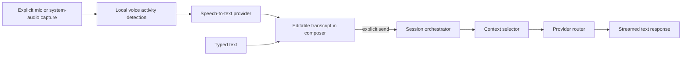
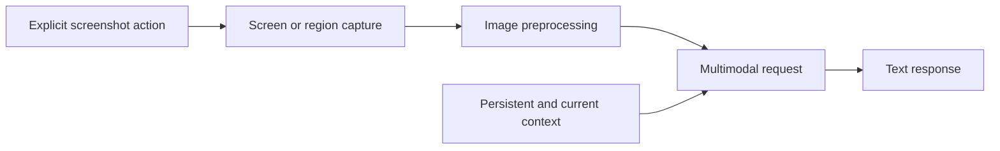
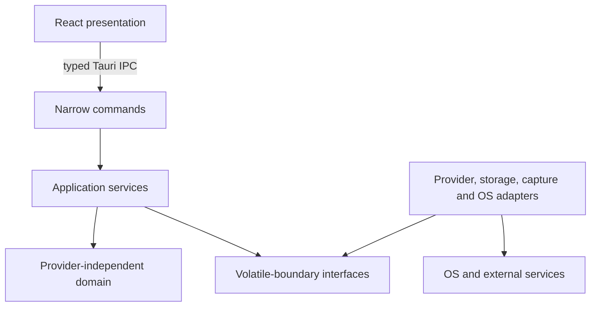
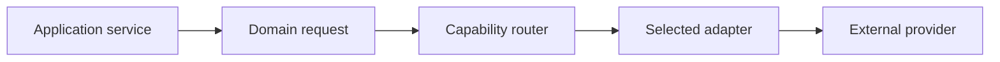

# Singularity Live engineering guide

This document is the canonical product architecture, engineering policy, roadmap, and
implementation-status record. It describes both current code and deliberately planned
boundaries. A capability is not implemented unless the current-status sections say so.

## 1. Product overview

Singularity Live is a backstage creative assistant for people making live or recorded
content: programming streams, coding tutorials, gameplay videos, and dynamic video scripts.
It helps a creator reason about code and images, develop an idea while recording, and respond
to speech from the creator or a co-host. The creator sees the assistant; the audience should
not see its window in the creator's broadcast or recording.

The core interaction accepts typed text, an explicitly selected screenshot, and explicitly
captured microphone or Windows system audio converted to text. The assistant returns text
only. Voice input is a way to provide context, not a request for spoken AI replies.

Keeping the assistant window out of supported screen-capture output while leaving it visible
and usable to the creator is a required product capability and release gate. Screenshot
capture can optionally hide the window; Windows content protection normally excludes it
without hiding it.

### Terminology

- **Session**: one continuous assisted interaction.
- **Context pack**: versioned persistent user context stored as a YAML manifest plus
  human-readable Markdown files.
- **Transcript entry**: a time-ordered text representation of spoken or typed input.
- **Assistant response**: contextual output associated with a session request.
- **Provider**: an external service adapter that supplies a capability.
- **Model**: a configurable provider-specific model identifier.
- **Capture**: an explicit audio or image acquisition operation.
- **Attachment**: metadata describing a saved or temporary session artifact.
- **Response mode**: creator intent such as Quick, Explain, Code, or Script.

## 2. Goals

- Help creators produce accurate code, explanations, and video ideas with low perceived
  latency and clear uncertainty when the model lacks enough information.
- Combine creator-selected speech, screenshots, typed input, user context, and recent session
  state safely.
- Convert incoming speech to editable text and return assistant replies as text only.
- Keep the assistant window out of supported broadcast and recording captures without
  hiding it from the creator.
- Keep providers replaceable and model identifiers configurable.
- Treat privacy, explicit capture state, and transient media handling as product behavior.
- Remain maintainable and cross-platform, with Windows as the primary production target.
- Keep the local desktop architecture proportionate: strong boundaries without speculative
  frameworks.

## 3. Non-goals

- A cloud account platform, multi-user backend, plugin marketplace, or distributed system.
- Permanent recording of raw audio or screenshots by default.
- Spoken AI replies or audio generation.
- Interview, exam, or assessment assistance; the product is for creator workflows.
- Claiming zero hallucinations or treating generated code as verified without review.
- Direct model-provider networking or secret storage in React.
- Implementing roadmap features before their phase begins.

## 4. MVP definition

The creator MVP has two input pipelines and one required desktop-output property:

```mermaid
flowchart LR
  Speech[Explicit mic or system-audio capture] --> VAD[Local voice activity detection]
  VAD --> STT[Speech-to-text provider]
  STT --> Composer[Editable transcript in composer]
  Text[Typed text] --> Composer
  Composer -->|explicit send| Session[Session orchestrator]
  Session --> Select[Context selector]
  Select --> Router[Provider router]
  Router --> Stream[Streamed text response]
```

```mermaid
flowchart LR
  Trigger[Explicit screenshot action] --> Capture[Screen or region capture]
  Capture --> Prepare[Image preprocessing]
  Prepare --> Request[Multimodal request]
  Context[Persistent and current context] --> Request
  Request --> Result[Text response]
```

The assistant window must also be excluded from supported broadcast/recording captures while
remaining visible on the creator's desktop. Voice transcripts are reviewed or edited in the
composer and sent only after the creator acts. Audio never produces spoken assistant output.
Live desktop verification is still pending.

## 5. Architecture

The application is a local desktop process with a presentation webview and a trusted Rust
core.

```mermaid
flowchart TD
  UI[React presentation] -->|typed Tauri IPC| Commands[Narrow commands]
  Commands --> Services[Application services]
  Services --> Domain[Provider-independent domain]
  Services --> Ports[Volatile-boundary interfaces]
  Adapters[Provider, storage, capture and OS adapters] --> Ports
  Adapters --> External[OS and external services]
```

Dependency direction is inward toward domain concepts. Commands translate the IPC boundary
and delegate; they do not contain business logic. Infrastructure adapters know their
external APIs. Domain types do not know React, individual providers, SQLite, xcap, or
WASAPI.

The current vertical slice contains application status, manual text assistance, explicit
screen assistance, and transient voice transcription. Requests pass through narrow Tauri
commands to Rust services. The session service loads selected context and sends bounded
role-tagged conversation history through the configured provider-independent router; a
screenshot request adds one temporary image to that request. One process-local session keeps
successful text turns and a rolling summary until reset or application restart. Voice input
remains outside session history until the creator edits and explicitly submits its transcript.

## 6. Frontend responsibilities

React owns:

- semantic, accessible presentation;
- local interaction and focused UI state;
- the manual request composer, incremental rendering of backend event streams, and a new
  session action that clears the visible conversation only after Rust confirms reset;
- visible screen-assistance capability and permission states, screenshot messages in the
  conversation, temporary crop and discard controls, and a composer for screenshot notes;
- one selected English context action shown as a non-editable prefix in the composer;
- minmode presentation toggled by a configurable global shortcut;
- explicit shortcut-binding edits and chord recording, plus hotkey-capture preview/error
  presentation;
- voice-source and microphone-device selection in Settings → Audio, a Record/Stop control in
  the composer, compact live transcription there, and composer insertion after stop;
- global quick-send activation that submits the current composer draft while the window is
  minimized without restoring it;
- persisted window-opacity and application-scale preferences exposed through Settings →
  Customization;
- Settings → AI & keys for choosing a provider/model, checking key presence, and revealing
  the Rust-owned local settings file in the system file manager;
- Settings → Context management for `.md` and `.txt` files that accompany every text or
  screenshot request;
- actionable loading, empty, and safe error states.

The frontend is feature-oriented. `src/app` composes the shell, `src/features` contains
product areas, `src/components/ui` contains small reusable presentation primitives,
`src/stores` contains focused Zustand stores, and `src/lib/tauri` is the typed IPC boundary.

React does not own provider orchestration, secrets, persistence, capture, or arbitrary host
access. It must not duplicate canonical backend session state unnecessarily.

## 7. Rust responsibilities

Rust owns:

- application services and session orchestration;
- provider communication and routing;
- Soniox WebSocket transcription and local voice activity filtering;
- credential lookup behind the Rust `SecretStore` port;
- provider profile and local key-file persistence, native file-manager integration, and
  first-run installation of the bundled example context pack;
- filesystem and platform paths;
- microphone, system-audio loopback, and screen capture;
- persistence and context loading, including Rust-owned customization settings;
- native context-file selection, validation, persistence, and per-request loading;
- image preprocessing, microphone enumeration, versioned audio, shortcut, and customization
  settings, native shortcut registration, click-through toggling, application zoom, system tray
  and taskbar-icon visibility lifecycle,
  cursor-to-screen/window resolution, and optional capture-window lifecycle;
- safe error mapping and structured technical logging.

Rust exposes `get_app_status`, the manual-assistance commands, narrow screen-assistance
commands for capability reporting, target listing, explicit capture, capture cancellation,
crop, discard, screenshot-assisted requests, and screenshot preferences, plus voice commands for persisted source
selection, active microphone enumeration, explicit start/stop, and `get_voice_input_settings`.
It also exposes typed `get_shortcut_bindings`, `update_shortcut_bindings`, `get_window_opacity`,
`set_window_opacity`, `get_app_scale`, `set_app_scale`, `get_screenshot_preferences`, and
`set_screenshot_preferences` commands. The native shortcut callback dispatches screenshot,
voice-input, audio-source, click-through, and taskbar-icon actions in Rust and emits minmode,
quick-send, and screenshot-send events for the
mounted composer; send actions do not restore a minimized window. A system-tray icon with
Show/Hide/Quit keeps the window reachable while hidden; the operating system chooses whether to
place the icon in the notification area or its overflow. `SessionService` validates text, selects
relevant static context, composes bounded system and role-tagged conversation messages,
summarizes older completed turns through the existing router when limits require it, permits
one active request, and returns typed failures. Capture, image processing, provider
networking, context loading, configuration, credential lookup, session state, cancellation,
and image deletion stay in Rust. Startup uses `expect` only for the invariant that a Tauri
application must initialize to run; runtime or user-controlled operations return typed
errors.

## 8. Security boundaries

The Tauri webview is untrusted relative to credentials and sensitive host operations.
Frontend code may request a defined action; Rust authorizes and executes it. Commands must
be narrow and typed—never a generic action dispatcher, filesystem gateway, shell wrapper,
HTTP proxy, or SQL endpoint.

Tauri capabilities grant only application commands declared in the Rust build manifest;
the main window receives application and manual-assistance permissions, the screen commands
`get_screen_capture_capabilities`, `list_screen_capture_targets`,
`start_screen_capture`, `capture_screen_from_ui`, `cancel_ui_screen_capture`,
`cancel_screen_capture`, `crop_screen_capture`, `discard_screen_capture`, and
`start_screenshot_assistance`, and the shortcut settings
commands `get_shortcut_bindings` and `update_shortcut_bindings`, plus `set_voice_input_source`,
`list_audio_input_devices`, `get_voice_input_settings`, `start_voice_input`, `stop_voice_input`,
`get_window_opacity`, `set_window_opacity`, `get_app_scale`, `set_app_scale`,
`get_screenshot_preferences`, `set_screenshot_preferences`, `get_user_context_files`,
`add_user_context_files`, and `remove_user_context_file`. File selection and content
persistence stay in Rust; the webview receives only names and opaque IDs. User context
content is bounded and is not logged. It also receives `get_provider_settings`,
`save_provider_profile`, and `open_provider_settings_file`; these return profile metadata and
key-presence flags, save provider/model choices, and reveal the settings file through a narrow
native action. The webview never receives API key values. It also receives
`core:event:allow-listen` and `core:event:allow-unlisten` for the streaming UI, and no plugin
permissions. Provider keys never enter Vite environment variables, localStorage, Zustand,
logs, or IPC requests or responses. Packaged desktop builds read plain-text credentials from
`provider-settings.json` under the application configuration directory; environment
credentials remain supported for development and take precedence when set. The file is
owner-only on Unix and inherits the application config directory's access controls on
Windows. OS-backed credential storage remains future security work.

Sensitive content is excluded from logs by default. API keys, authorization headers, raw
audio, screenshots, full context packs, and full provider payloads must not be logged.

## 9. Provider architecture

Text generation has direct OpenAI, Gemini, and OpenRouter adapters. Each accepts the same
provider-neutral text and request-scoped PNG image parts. The selected default profile is
`gpt-6-luna` for text, screenshots, code, and explanations. Gemini and OpenRouter remain
selectable alternatives. Provider choice is an infrastructure setting, not a domain
dependency.

Soniox `stt-rt-v5` supplies streaming speech-to-text independently from text generation. Its
Rust WebSocket adapter sends Russian, Ukrainian, and English language hints and technical
terms, then emits a live transcript. User API keys are read by Rust from the local settings
file or development process environment and remain inside Rust. Automated checks use mocks; live OpenAI/Soniox requests
and real audio-device checks have not been verified yet. Evaluate Russian/Ukrainian technical
transcripts, screenshot interpretation, code correctness, latency, and cost before calling
either path production-ready.

```mermaid
flowchart LR
  Service[Application service] --> Request[Domain request]
  Request --> Router[Capability router]
  Router --> Adapter[Selected adapter]
  Adapter --> Vendor[External provider]
```

The router selects OpenAI, OpenRouter, or Gemini from typed startup configuration and enforces
the configured model and provider-stream timeout. It supports cancellation and classifies
authentication, configuration, invalid-request, rate-limit, timeout, transport, provider,
cancellation, and malformed-response failures. It does not retry or fall back. Provider DTOs, endpoints,
authorization headers, and SSE parsing stay inside the adapter. Prompt construction is
centralized behind a context selector and prompt builder, never assembled in components.

## 10. Context architecture

Runtime context packs live under Tauri's platform-specific application data directory at
`context-packs/<pack-id>/`, never a hard-coded user path or the Git checkout. A pack uses a
strict schema-versioned YAML manifest that references human-readable Markdown files. The
repository includes a fictional and sanitized example. The loader rejects packs outside
application data, symlinked pack directories, unknown schema fields, invalid paths,
traversal and symlink escapes, missing files, and content beyond documented size limits.

Creators can add up to 8 `.md` or `.txt` files from Settings → Context. Rust stores their
UTF-8 contents in a versioned `user-context.json` file under application data, with a
combined 12 KiB content limit. These documents are prepended to the context pack selection
for every manual text and screenshot request, so relevance keywords do not filter them out.
React receives only file names and opaque IDs. The bounded system prompt places user files
before keyword-selected context-pack documents.

Context selection is layered:

1. always-included user context files;
2. relevant static context;
3. rolling session summary;
4. recent transcript turns;
5. the current text, speech, or screenshot input.

The current deterministic selector preserves manifest order and includes `always_include`
documents plus documents whose configured complete keyword or phrase occurs in the text
request or the prior text intent for a legacy screenshot follow-up. New screenshot messages
use their current note to select static context. It omits non-matching context-pack documents;
the user-added files above always remain in the prompt.
A Rust-owned session also includes
prior successful user and assistant messages in chronological order and automatically
compacts older turns into a rolling summary when recent history exceeds either bound. A
screenshot message selects static context using its note, includes prior role-tagged messages,
and sends the current image only in that request. Completed history and rolling summaries
retain text only. Captured audio is not part of session history; a transcript
enters through the same editable text composer and explicit send action as typed text.

## 11. Session architecture

One process-local `SessionService` owns a generated session ID, `Idle`/`Active`/`Processing`
lifecycle, completed text exchanges, a rolling summary, and the active request's cancellation
token under one state lock. A screenshot request includes a temporary image in the current
provider message but stores only its text continuation prompt and completed text answer after
success. Only successfully completed text exchanges enter later model context. A failure or
cancellation leaves prior turns available, excludes any partial answer, and releases the
image. Reset is rejected while processing; otherwise it clears recent turns and summary and
returns to an idle session with a fresh ID. Reset also deletes any pending screenshot. A
process restart begins with an empty session and no retained image.

Current manual input is capped at 16 KiB. Recent history is capped at 8 exchanges and
16 KiB, the system context at 20 KiB, the rolling summary at 4 KiB, each retained assistant
answer at 16 KiB, and summary-request system plus conversation text at 64 KiB. Limits count
UTF-8 bytes. When needed, Rust stages oldest-turn summaries through the existing router and
replaces the stored summary and removed turns only after every required summary call
succeeds. Context pack loading runs on a blocking worker; provider and summary calls honor
request cancellation.

The session is deliberately volatile and has no event or chat-history persistence. It does
not introduce multiple chats, SQLite, persistent audio inputs, or response modes. A single
explicitly submitted screenshot may accompany one provider request and is deleted afterward;
images do not enter session history. Future session event records may use stable IDs,
timestamps, source, and kind, but a durable event log is not part of the current implementation.

## 12. Storage plan

SQLite will eventually store structured sessions, transcript entries, assistant responses,
attachment metadata, provider-request metadata, summaries, and history behind a Rust
repository layer. Screenshots and audio will use file storage plus references when users
explicitly choose persistence; large media is not stored as SQLite blobs by default.

The SQLite library and migration approach will be chosen in Phase 5 and recorded in an
ADR. No database crate or durable runtime storage exists; the implemented manual-text
session remains volatile and in memory.

## 13. Audio and transcription

The implemented flow is `AudioSource → local energy gate → Soniox WebSocket → live transcript
→ editable composer`. Creators can choose Windows system-audio loopback for a co-host or game
conversation, or select any active microphone endpoint by its Windows device name. The default
microphone remains an option. WASAPI enumerates and captures devices in Rust on blocking
workers and requests 16 kHz mono PCM. Other platforms report the audio source unavailable.

A local RMS energy gate keeps a short pre-roll and speech tail, and drops sustained silence
before it reaches the network. Soniox `stt-rt-v5` receives speech frames, a keepalive during
long pauses, Russian/Ukrainian/English language hints, common programming terms, and endpoint
detection for pauses between phrases. A global Voice input shortcut or the chat composer
Record/Stop button toggles recording. The selected source and microphone endpoint persist in a
versioned Rust-owned settings file and are configured in Settings → Audio. The selected
microphone name or “System audio” appears beside the backend status. Live transcription appears
in the composer; the finalized transcript is inserted there for review and editing, and the user
separately sends it to text generation. Assistant output remains text only.

Raw PCM exists only in the capture-to-WebSocket buffer and is discarded; audio and transcripts
are not written to disk or session history. The current implementation has no reconnect flow
or measured latency data. Real device and live-provider checks are pending.

## 14. Screenshot assistance

Capture runs in Rust after an explicit user action. A Rust-owned preference chooses the screen
or window under the pointer and whether to hide the assistant while capturing. Hiding is off
by default. XCap provides one-shot monitor and window capture on Windows, macOS, and X11.
Linux Wayland uses the visible XDG ScreenCast picker and one PipeWire frame with portal
persistence disabled; unsupported backends report that state. Region selection crops the
reviewed in-memory preview. Rust bounds dimensions and encoded size. The preview appears in
the conversation and can be cropped, annotated with text, and sent with one selected prompt
prefix: `explain`, `tell me more`, or `fix`.

One image remains in an in-memory Rust store for no more than five minutes. Send, discard,
replacement, reset, cancellation, processing errors, expiry, and process exit release its
bytes. The provider request combines it with the current screenshot note and role-tagged text
context; a preceding text question is not required. Completed session history keeps text only.
The UI may display its in-memory preview in the current conversation until the capture expiry,
reset, or unmount. Images and preview data are never persisted or logged. OCR is deferred
until benchmarks show a benefit for indexing, local extraction, or cost reduction.

## 15. Testing strategy

- Frontend behavior uses Vitest and React Testing Library with external IPC mocked at the
  Tauri API boundary. Tests cover readiness, event validation, streaming, stale events,
  duplicate submission, keyboard behavior, cancellation, failure recovery, and focus.
- Rust domain and application behavior uses unit and integration tests.
- OpenRouter uses a local mock HTTP server for request mapping, SSE parsing, still-image
  serialization, provider error classification, timeout, and cancellation. OpenAI maps the
  same text and image parts to Chat Completions; Gemini maps images to inline data. No live
  provider request has been verified in this feature.
  Voice tests cover transcript updates and local silence filtering; live audio-device checks
  remain a manual requirement.
  Capture tests use fake backends; session tests use a fake router for follow-up context,
  screenshot composition, bounds and summaries, relevance filtering, reset, cancellation,
  and recovery after failures. Automated tests need no API key and make no provider calls.
- Tests protect observable behavior, not private structure or prose.
- CI runs formatting, linting, type checking, tests, and builds for the current foundation.

The shell tests backend readiness and honest setup states; focused frontend tests exercise
the manual request flow, and Rust tests cover provider-independent behavior and the local
OpenRouter mock-server boundary.

## 16. Repository conventions

- Use pnpm and commit `pnpm-lock.yaml`; commit `src-tauri/Cargo.lock` for the application.
- Keep TypeScript strict and avoid `any`, suppression comments, and unsafe assertions.
- Avoid runtime `unwrap` in Rust and blocking work on async threads.
- Add a dependency only for an implemented capability.
- Use conventional semantic commit messages and feature-oriented branch names without
  `codex/`, `phase/`, or other agent/tool prefixes.
- Do not include coding-agent names or generated attribution in source, branches, or commits.
- Keep local orchestration in ignored `AGENTS.md` and `.ai/`; product decisions belong here
  or in ADRs.
- Update this document with material architecture or implementation-status changes.
- Use UTC internally for future persisted timestamps and stable IDs for entities.

The Tauri identifier is provisionally `local.singularity.live`. The `local` namespace avoids
claiming an internet domain and must be replaced with an owned release identifier before
signed distribution.

## 17. Platform strategy

Windows is the primary production target and the first target for broadcast capture
protection. Linux and macOS are secondary desktop targets. Shared domain and application
layers remain platform-independent; capture, audio, shortcuts, credential storage,
permissions, and capture protection live behind target-specific adapters.

Tauri content protection is enabled for the Windows main window. The Linux windowing backend
does not support this feature. A macOS implementation requires a separate platform decision
and validation; do not describe a build as broadcast-protected unless its capture behavior
has passed the release checks.

Unsupported functions should be surfaced through future capability reporting rather than
random runtime failure. Paths always use Tauri/platform APIs. Packaging, signing, installers,
updates, and full cross-platform validation are Phase 7 work.

## 18. Risks and open questions

- The best secure credential crate and its behavior across all targets require evaluation.
- Windows loopback capture and Linux/macOS system-audio parity may require different adapters.
- VAD accuracy, resource cost, and packaging need measurement on target hardware.
- Provider latency, availability, and pricing require routing metrics without payload logging.
- Context selection needs evaluation to avoid irrelevant or privacy-heavy prompts.
- Screenshot permission and window/region capabilities differ by display server and OS.
- Broadcast software uses different capture APIs; operating-system window protection must be
  verified with the actual supported recording and streaming paths.
- IPC type drift may justify generated bindings once the command surface becomes substantial.
- The provisional application identifier must change before distribution.

## 19. Roadmap

Each phase is complete only after its acceptance criteria are validated. Architecture
preparation does not partially complete a future phase.

### Phase 0 — Foundation

**Goal:** Establish the repository, architecture, desktop shell, security boundary,
documentation, tests, and CI without external AI functionality.

**Scope:** React/Tauri bootstrap, typed status IPC, minimal Zustand state, polished idle
shell, strict tooling, local agent safeguards, architecture record, and validation workflow.

**Out of scope:** Providers, credentials, capture, audio, persistence, real sessions,
shortcuts, overlays, tray behavior, updater, installers, and signing.

**Deliverables:** Buildable desktop foundation, frontend/Rust tests, lockfiles, README,
this guide, focused ADRs, ignored local `AGENTS.md`, and GitHub Actions CI.

**Acceptance criteria:** All checks in Section 20 pass; the Tauri shell launches with real
IPC where the environment supports GUI execution; documentation matches the code; no
tutorial remnants, secrets, fake behavior, or future dependencies exist.

**Status:** Completed

### Phase 1 — Context and provider core

**Goal:** Support safe manual text assistance through provider-independent context and model
boundaries.

**Scope:** Context-pack model/loading, typed configuration, secret-store abstraction,
provider ports and initial adapters, provider routing, streaming text, manual input, and
assistant rendering.

**Out of scope:** Screenshot and audio capture, full session intelligence, SQLite history,
and release packaging.

**Deliverables:** Sanitized context example, secure credential boundary, provider adapters,
streaming request path, manual input UI, tests, and relevant ADRs.

**Acceptance criteria:** Secrets never cross IPC; manual requests stream through the router;
context schemas validate; adapters and failure mapping are tested; docs match implementation;
a real desktop request is verified when a user-supplied development credential is available.

**Status:** Completed — implementation and automated checks are complete; the user manually
verified a real desktop OpenRouter request with text context on 2026-09-26.

### Phase 2 — Screen understanding

**Goal:** Add explicit transient screenshot assistance with current conversation context.

**Scope:** Monitor/region capture, supported window capture, preprocessing, multimodal path,
preview, and transient-lifecycle behavior.

**Out of scope:** Audio, OCR without benchmark justification, and implicit persistence.

**Deliverables:** Rust capture adapters, capability reporting, multimodal requests, preview
UI, permission/error states, and privacy tests.

**Acceptance criteria:** Users explicitly trigger capture; temporary images are deleted;
unsupported capabilities are clear; screenshot + text context produces a tested result.

**Status:** Completed — mock-backed Rust and UI tests cover explicit capture and preview,
permissions and unsupported states, bounded transient image lifetime and deletion, the
previous text request plus screenshot through the provider boundary, safe errors, and
cancellation. Full project checks passed on 2026-09-26; automated validation used neither
live provider requests nor real screen captures.

### Phase 2.5 — Global capture and voice-input shortcuts

**Goal:** Let users explicitly start screenshot capture or voice input through configurable
global shortcuts while the application is running.

**Scope:** Rust-owned shortcut registration and versioned non-secret bind settings; a Binds
view for recording, clearing, adding, removing, and saving screenshot, screenshot-send,
taskbar-icon toggle, voice-input toggle, quick-send, and minmode shortcuts; quick send of the
current composer draft and sending a reviewed screenshot without restoring a minimized window;
a system-tray Show/Hide/Quit menu; monitor/window-under-pointer capture on native desktops and
the existing consent-driven source picker on Wayland; optional close-on-capture coordination;
and an optional development launcher.

**Out of scope:** OCR, persistent screenshot data, stored API keys, launch-at-login behavior,
and actions other than Screenshot, Send screenshot, Hide/show taskbar icon, Voice input, Quick
send, and Minmode.

**Acceptance criteria:** Screenshot, voice toggle, and quick send work while the app is active
or minimized; quick send uses the current composer draft and leaves the window minimized; the
capture uses the saved source and optional close-on-capture preference; binding edits validate
and roll back safely; preview remains temporary and is sent only by explicit user
action; the dev launcher does not echo or persist credentials; automated tests pass; and manual
desktop smoke checks pass on supported operating systems.

**Status:** In progress — earlier shortcut implementation and automated validation are
recorded. The new minmode and screenshot-composition changes have not yet been validated.
Manual desktop smoke checks for active/minimized activation, tray restore, quick send while
minimized, always-on-top restore, capture source/visibility behavior, and platform permission
flows remain pending.

### Phase 2.6 — Broadcast capture protection

**Goal:** Keep the assistant usable on the creator's desktop while excluding its window
contents from supported screen recordings and broadcasts.

**Scope:** Enable Tauri `contentProtected` on the Windows main window; document platform
support and verify the output with supported screen-capture sources. This protects the
assistant window in external capture. Phase 2.5 can optionally hide the window for this app's
own screenshot workflow; that preference defaults to off.

**Out of scope:** Hiding the application from the creator, camera-based recording, DRM or
security guarantees, and claiming support for capture backends that have not been verified.

**Acceptance criteria:** The Windows main window requests content protection at startup; the
creator can still use the visible window; supported OBS display and window capture omit the
assistant contents on Windows 10 version 2004 or later; documentation names unsupported or
unverified platforms; no roadmap phase or release may claim broadcast protection before these
checks pass.

**Status:** Implemented in the Windows Tauri configuration; manual OBS smoke checks have not
yet been recorded.

### Phase 3 — Audio and transcription

**Goal:** Give creators low-latency voice input from their microphone or supported system
audio, including a co-host's speech, and turn it into editable text for the assistant.

**Scope:** Explicit start/stop from the chat composer, audio-source and per-microphone
selection in Settings → Audio, Windows loopback and microphone capture, local energy gate,
Soniox `stt-rt-v5`, live transcript presentation in the composer, transcript review and text
submission, and latency metrics. Generated responses stay text-only.

**Out of scope:** Permanent recording, cloud silence detection, and advanced session routing.

**Deliverables:** Platform audio adapter, local speech gate, Soniox adapter, transcript events,
UI, privacy-safe metrics, and tests.

**Acceptance criteria:** Capture is visibly active and user-started; the selected speaker is
transcribed into editable text; the creator decides when to send it; silence stays local; raw
segments are discarded; no spoken assistant response is generated; long sessions reconnect
without losing transcript context; measured latency is documented.

**Status:** In progress — persisted microphone/system-audio selection, Windows WASAPI capture,
local energy filtering, Soniox streaming, a voice shortcut action, and composer Record/Stop with
editable transcript insertion are implemented. Real device and live-key checks, reconnect
behavior, and measured latency remain unverified.

### Phase 4 — Session intelligence

**Goal:** Combine creator-session memory, context relevance, modalities, and code, explanation,
and dynamic-script response modes.

**Scope:** Complete lifecycle, recent turns, rolling summaries, intent/context routing,
combined screenshot and user-submitted transcript requests through GPT-6 Luna, modes,
interruption, and cancellation.

**Out of scope:** Long-term history UI and release packaging.

**Deliverables:** Session orchestrator, summary/context services, multimodal composition,
response-mode behavior, cancellation, and integration tests.

**Acceptance criteria:** One active session combines supported inputs; irrelevant static
context is excluded; cancellation is reliable; lifecycle/error states are explicit.

**Status:** In progress — the manual-text session has bounded role-tagged history, automatic
static-context selection, provider-mediated rolling summaries, lifecycle reset, and
cancellation/error coverage. The Phase 2 screenshot path now composes one temporary image
with prior text intent and context. Transcript composition, response modes, broader
multimodal session behavior, and other unsupported inputs remain unimplemented.

### Phase 5 — Persistence and context management

**Goal:** Persist structured history and let users manage context and retention locally.

**Scope:** SQLite, migrations, history, context management/import/export, preferences,
retention, and explicit attachment persistence.

**Out of scope:** Cloud synchronization and implicit raw-media retention.

**Deliverables:** Storage ADR, repository adapters, migrations, management UI, settings,
retention enforcement, and tests.

**Acceptance criteria:** Migrations are repeatable; React cannot issue SQL; platform data
paths are used; export/import is validated; retention behavior is explicit and tested.

**Status:** Not started

### Phase 6 — Reliability and security

**Goal:** Harden failures, credentials, routing, recovery, and local observability.

**Scope:** Retry/timeout/fallback policy, rate limits, credential implementation, log
scrubbing, recovery, offline-safe behavior, and diagnostics.

**Out of scope:** New core product modalities and release signing.

**Deliverables:** Secure store adapter, policy router, scrubbed structured logging,
diagnostics, recovery paths, and fault-injection tests.

**Acceptance criteria:** Failure classes drive correct retry/fallback behavior; credentials
are OS-backed; sensitive payloads never log; offline startup is safe; recovery is tested.

**Status:** Not started

### Phase 7 — Desktop polish and release

**Goal:** Produce accessible, performant, signed release artifacts for supported platforms.

**Scope:** Shortcuts, compact behavior, settings polish, accessibility, performance,
production icons, installers, release automation, update/signing strategy, and platform
validation.

**Out of scope:** Unrelated cloud services.

**Deliverables:** Release UX, signed installers where configured, measured performance,
cross-platform reports, and release documentation.

**Acceptance criteria:** Supported installers launch and update safely; accessibility checks
pass; broadcast capture protection passes its supported-platform checks before release;
shortcuts and compact mode are ordinary visible UX; measurements are reproducible.

**Status:** Not started

## 20. Current implementation status

### Implemented

- pnpm workspace with pinned package manager and committed lockfile.
- Strict React/TypeScript/Vite/Tailwind frontend with focused Zustand stores.
- Accessible desktop shell with a manual text composer, streaming response, cancellation,
  readiness guidance, safe failures, keyboard handling, and focus restoration.
- Responsive frontend conversation view with Markdown/code formatting and an ephemeral
  transcript; completed turns are sent as bounded role-tagged context for follow-up requests.
- A single in-memory Rust session with automatic current-input relevance filtering, bounded
  recent exchanges and system context, rolling summaries through the existing router, and a
  reset lifecycle that rejects active requests.
- Accessible **New session** action that waits for Rust reset confirmation before clearing
  visible turns and preserves the conversation with a safe error if reset fails.
- Explicit screen assistance with capability and permission states, monitor/window capture,
  validated region crop, in-memory preview, screenshot composition in the conversation, and
  cleanup on expiry, reset, unmount, errors, and cancellation.
- Rust-only platform capture adapters, bounded image preparation, a five-minute transient
  image store, request-scoped image parts through the provider-neutral router, and OpenRouter
  and Gemini image mappings that preserve text-only request compatibility.
- Versioned screenshot, screenshot-send, taskbar-icon toggle, voice-input, audio-source toggle,
  click-through toggle, quick-send, and minmode bindings,
  transactional native shortcut registration and Wayland portal integration,
  monitor/window-under-pointer capture coordination, an always-on-top window lifecycle, system tray,
  and Settings → Binds.
- Rust-owned Soniox real-time speech transcription, a local RMS energy gate, Windows
  microphone enumeration and selection plus system-audio capture through WASAPI, live
  transcription in the composer, and explicit insertion after stopping.
- A full-width chat layout without the Session sidebar or separate Transcript panel, screenshot
  messages and crop controls in the conversation, selectable context prefixes, a composer
  Record/Stop button, and Settings → Audio and Customization
  with Rust-persisted, adjustable app-window opacity and application zoom.
- Settings → Context file management for `.md` and `.txt` documents persisted by Rust and
  included in every text and screenshot request within explicit count and size limits.
- Direct OpenAI GPT-6 Luna text and screenshot streaming alongside OpenRouter and Gemini;
  API keys stay in Rust and may be loaded from the local provider settings file.
- Settings → AI & keys for model-profile selection, key-presence status, and native reveal of
  the editable `provider-settings.json` file; new requests reload saved profile and key data.
- First-run installation of the sanitized example context pack and a Windows-only executable
  build command (`pnpm build:exe`) that skips installer bundling.
- A minmode bind that hides app chrome while keeping the conversation and composer visible.
- Rust-persisted screenshot source selection and the optional “Close window on screenshot” setting.
- Global shortcuts that swap the saved microphone/system-audio source and toggle mouse
  click-through; Rust-persisted webview zoom from 70% to 130% in 10% steps.
- Windows-specific Tauri `contentProtected` configuration for the main window. Its behavior
  with real OBS display and window capture still needs manual smoke validation.
- A development-only interactive/argument launcher with numbered workflow, model, and
  installed context-pack choices that passes credentials only to the spawned process
  without echoing or persisting them.
- Typed clients for application status and manual-assistance IPC; unknown event payloads are
  validated at runtime and stale request IDs are ignored.
- Rust application-status service and `SessionService` with one active request.
- Versioned context-pack validation, safe Markdown loading, deterministic selection, and
  bounded prompt construction.
- Bounded Rust-persisted user context files included in every text and screenshot prompt and
  managed through narrow Tauri commands.
- Typed OpenAI/OpenRouter/Gemini configuration, Rust-only environment secret lookup for
  `OPENAI_API_KEY`, `SONIOX_API_KEY`, `OPENROUTER_API_KEY`, and `GEMINI_API_KEY`,
  provider-independent text-generation ports, router, streaming adapters, timeout,
  cancellation, and safe failure classification.
- Explicit permissions for the implemented application and screen-assistance commands and
  event listening and cleanup, no Tauri plugin permissions, and a production content security
  policy without `unsafe-inline`.
- Fictional context-pack example, OpenAI/Soniox/OpenRouter/Gemini setup instructions, and
  focused provider and credential-boundary ADRs.
- Frontend behavior test, formatting, lint, type checking, build scripts, and CI.
- Rust formatting, Clippy, test, and check scripts.
- Public README, this engineering guide, and focused ADRs.
- Ignored local `AGENTS.md`, `.ai/`, and common agent metadata.

### Architecturally planned, not implemented

OS-backed credential storage, multiple chats, persisted session history, reconnecting long
audio streams, OCR, SQLite, history management, updater, signing, and
production packaging.

### Phase 0 validation record

Phase 0 was validated on 2026-09-21. The native process and real IPC response were inspected
through WebKitGTK's development inspector; no capture or provider permissions were granted.

| Check                                          | Result                                                      |
| ---------------------------------------------- | ----------------------------------------------------------- |
| Frontend format, lint, typecheck, tests, build | Passed on Node 24.21.0 and pnpm 12.5.1                      |
| Rust fmt, Clippy, tests, check                 | Passed on Rust 1.98.0                                       |
| Tauri GUI launch and real IPC                  | Passed; native webview reported `Backend ready` at 1080×720 |
| Ignore rules, metadata, tutorial, secret scan  | Passed repository review                                    |
| README command and architecture accuracy       | Passed repository review                                    |

### Context and provider validation record

Automated tests use local fixtures and mock HTTP responses; they do not need
`OPENROUTER_API_KEY` and do not make live or paid provider calls. The user manually verified
the real desktop OpenRouter text-context flow on 2026-09-26; this satisfies Phase 1's final
acceptance criterion.

| Check                                                                                 | Result                                                                                  |
| ------------------------------------------------------------------------------------- | --------------------------------------------------------------------------------------- |
| `CARGO_INCREMENTAL=0 CARGO_PROFILE_DEV_DEBUG=0 CARGO_PROFILE_TEST_DEBUG=0 pnpm check` | Passed on 2026-09-25: 11 frontend tests, 47 Rust tests, lint, types, builds, and checks |
| Tauri development startup                                                             | Built and started the native binary with provider configuration explicitly unset        |
| Live OpenRouter request                                                               | User manually verified real desktop text-context assistance on 2026-09-26               |

Direct Gemini text and screenshot generation was added on 2026-09-27. Formatting, lint,
TypeScript checks, frontend build, and Rust compilation passed. Rust Clippy reported only
the existing platform-shortcut dead-code warnings. The new Gemini adapter has not yet been
verified with a live API key; automated tests were not run for this change.

### Session intelligence validation record

This stage adds one volatile manual-text session. It does not complete Phase 4: broader
multimodal composition, transcript inputs, and response modes remain planned. All provider
tests use local mocks or a fake router; no live OpenRouter call is required.

| Check                               | Result                                                                                                  |
| ----------------------------------- | ------------------------------------------------------------------------------------------------------- |
| Rust backend tests                  | Passed: 66 tests, including follow-up, bounds, compaction, relevance, reset, cancellation, and recovery |
| Frontend reset and transcript tests | Passed: 14 targeted tests covering reset IPC, success ordering, busy state, and failure preservation    |

### Global shortcut and developer launcher validation record

Automated checks use mock shortcut registrars, capture backends, portal sessions, and local
provider fixtures. They do not capture the desktop or make live provider requests. The
manual desktop smoke criteria remain outstanding.

| Check                                          | Result                                                                                                                                           |
| ---------------------------------------------- | ------------------------------------------------------------------------------------------------------------------------------------------------ |
| Frontend format, lint, typecheck, tests, build | Passed on 2026-09-27: 44 tests across 10 files                                                                                                   |
| Rust format, Clippy, tests, and check          | Passed on 2026-09-27: 119 tests and `cargo check`                                                                                                |
| Tauri development startup                      | Started on Linux Wayland with provider configuration and `OPENROUTER_API_KEY` unset                                                              |
| Desktop smoke on supported operating systems   | Attempted on Ubuntu 24.04.4 / GNOME 46 Wayland: GlobalShortcuts portal interface is absent, so binds cannot register; Xorg smoke remains pending |
| Full project `pnpm check`                      | Passed on 2026-09-27: 44 frontend tests, 119 Rust tests, formatting, lint, TypeScript, build, Clippy, and Cargo check                            |

### OpenAI and voice input validation record

Automated checks use local tests and do not make paid OpenAI or Soniox requests. Desktop audio
capture requires Windows hardware and operating-system access; live provider and microphone
smoke checks remain pending until the user supplies credentials and tries the feature.

| Check                                | Result                                                                                                                |
| ------------------------------------ | --------------------------------------------------------------------------------------------------------------------- |
| Full project `pnpm check`            | Passed on 2026-09-28: 46 frontend tests, 118 Rust tests, formatting, lint, TypeScript, build, Clippy, and Cargo check |
| Live GPT-6 Luna text and image call  | Not run; requires the user's OpenAI API key                                                                           |
| Soniox microphone/system-audio smoke | Not run; requires the user's Soniox API key and Windows audio devices                                                 |

### Chat composer, shortcuts, microphone selection, and appearance validation

The update removes the Session rail and separate Transcript panel. Screenshot controls sit
above the independently scrolling conversation; voice source selection is in Settings → Audio
and Record/Stop is beside Send. Global quick send sends the current composer draft without
restoring the window. Windows microphone choices are enumerated in Rust, and app opacity is
stored in the Rust-owned customization file.

| Check                                               | Result                                                                                                                                    |
| --------------------------------------------------- | ----------------------------------------------------------------------------------------------------------------------------------------- |
| Full project `pnpm check`                           | Passed on 2026-09-28: formatting, lint, TypeScript, 53 frontend tests, production build, Rust fmt/Clippy, 122 Rust tests, and Cargo check |
| Real microphone selection and Soniox transcription  | Not run; requires a live Windows audio device and the user's Soniox API key                                                               |
| Minimized quick-send and global shortcut activation | Not run in the native desktop window                                                                                                      |
| Windows transparency and capture protection         | Configured; visual transparency and OBS capture smoke checks remain pending                                                               |

### Audio-source shortcut and application-scale validation

The audio-source bind updates the Rust-persisted choice and the Settings store. Click-through
uses a separate process-state shortcut action, and application zoom is stored and applied by
the native webview. The automated run uses local settings and shortcut fixtures; it does not
exercise a live desktop, audio device, or provider.

| Check                                          | Result                                                                                                                |
| ---------------------------------------------- | --------------------------------------------------------------------------------------------------------------------- |
| Full project `pnpm check`                      | Passed on 2026-09-28: 61 frontend tests, 130 Rust tests, formatting, lint, TypeScript, build, Clippy, and Cargo check |
| Native shortcut, click-through, and zoom smoke | Not run in the native desktop window                                                                                  |

### Screen assistance validation record

All provider-facing tests use local mock HTTP responses or a fake Rust router. The run did
not send a live provider request or capture a real desktop image.

| Check                                         | Result                                                                                                                                                                     |
| --------------------------------------------- | -------------------------------------------------------------------------------------------------------------------------------------------------------------------------- |
| Frontend tests                                | Passed: 25 tests across 4 files                                                                                                                                            |
| Rust tests                                    | Passed: 94 tests, including capability/permission states, expiry/deletion, screenshot plus prior text context, provider errors/cancellation, and PipeWire frame conversion |
| Full project `pnpm check`                     | Passed on 2026-09-26: formatting, ESLint, TypeScript, frontend tests, production build, Rust fmt/Clippy/tests, and Cargo check                                             |
| Live provider request and real screen capture | Not performed; automated acceptance used mocks and in-memory pixel fixtures                                                                                                |

### Local provider settings and Windows executable validation

This update stores API keys in an editable local settings file that remains inside Rust, adds
provider/model selection in Settings, seeds the built-in example context pack on first launch,
and builds a standalone Windows executable without an installer.

| Check                             | Result                                                                                               |
| --------------------------------- | ---------------------------------------------------------------------------------------------------- |
| Frontend typecheck and lint       | Passed on 2026-09-28                                                                                 |
| Frontend production build         | Passed as part of `pnpm build:exe`                                                                   |
| Rust fmt, Clippy, and Cargo check | Passed on 2026-09-28                                                                                 |
| Windows executable build          | Release binary compiled with the GUI subsystem and saved as `src-tauri/target/release/singularity-live-updated.exe`; the Tauri wrapper could not replace the usual output while the previous executable was running |
| Changed-file Prettier check       | Passed                                                                                               |
| Repository-wide Prettier check    | Reports existing formatting warnings in 8 untouched files; no unrelated formatting changes were made |
| Automated tests                   | Not run for this update                                                                              |

### Toolchain and tested versions

The project requires Node.js 24 LTS, pnpm 12.5.1, and Rust 1.98.0. Exact JavaScript and
Rust dependency resolutions are authoritative in their lockfiles. Bootstrap selected these
current stable compatible direct versions:

| Tool or library                | Version         |
| ------------------------------ | --------------- |
| React / React DOM              | 19.3.0          |
| TypeScript                     | 6.0.3           |
| Vite                           | 8.3.0           |
| Tauri JavaScript API / CLI     | 2.11.1 / 2.11.5 |
| Tauri Rust crate / build crate | 2.11.6 / 2.6.3  |
| Tailwind CSS                   | 4.3.3           |
| Zustand                        | 5.0.15          |
| Vitest / React Testing Library | 5.0.1 / 16.3.3  |
| Rust                           | 1.98.0          |

## 21. Decision log and ADR references

- [ADR 0001: Tauri desktop architecture](docs/adr/0001-tauri-desktop-architecture.md)
- [ADR 0002: Provider-neutral application boundary](docs/adr/0002-provider-neutral-application-boundary.md)
- [ADR 0003: OpenRouter and the manual-assistance trust boundary](docs/adr/0003-openrouter-manual-assistance-boundary.md)
- [ADR 0004: Ephemeral session context and Rust-owned lifecycle](docs/adr/0004-ephemeral-session-context.md)
- [ADR 0005: Ephemeral screen assistance and provider-neutral image requests](docs/adr/0005-ephemeral-screen-assistance.md)
- [ADR 0006: Global screenshot shortcuts and Rust-owned capture lifecycle](docs/adr/0006-global-screenshot-shortcuts.md)
- [ADR 0007: Direct Gemini generation for text and screenshots](docs/adr/0007-gemini-generation.md)
- [ADR 0008: Windows broadcast capture protection](docs/adr/0008-windows-broadcast-capture-protection.md)
- [ADR 0009: OpenAI generation and Soniox voice transcription](docs/adr/0009-openai-soniox-providers.md)
- [ADR 0010: Transparent window opacity customization](docs/adr/0010-transparent-window-opacity.md)
- [ADR 0011: Screenshot messages and minmode](docs/adr/0011-screenshot-messages-and-minmode.md)
- [ADR 0012: Audio-source, click-through, and application-scale controls](docs/adr/0012-audio-source-click-through-and-scale.md)
- [ADR 0013: Persistent user context files](docs/adr/0013-user-context-files.md)
- [ADR 0014: Local provider settings for desktop builds](docs/adr/0014-local-provider-settings.md)

Future ADRs are created only for decisions that need durable context, including OS-backed
secret storage, SQLite/migration strategy, VAD implementation, and materially changed platform
boundaries. Routine implementation details do not require ADRs.
